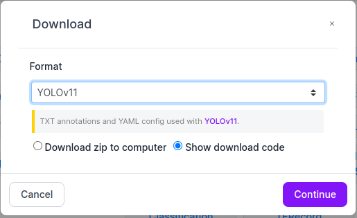

# UltraFlwr: Federated Object Detection 
Official repository for *Federated Medical and Surgical Object Detection on the Edge*.

UltraFlwr provides random and equally sized YOLO compatible data partitioning, federated training, and flexible testing capabilities. It integrates [Ultralytics](https://github.com/Ultralytics/Ultralytics) YOLO off-the-shelf within the [Flower](https://github.com/adap/flower) framework.

Developed by anonymized authors.

--------

Inspiration from existing issues:

1. Exact Ask in Ultralytics Library | [Issue](https://github.com/orgs/Ultralytics/discussions/9440)
2. Problem of loading the YOLO state | dict [Issue](https://github.com/Ultralytics/Ultralytics/issues/8804) 
    - (Similar issue raised by us: [Issue](https://github.com/Ultralytics/Ultralytics/issues/18097))
3. Need to easily integrate flower strategies with Ultralytics | [Issue](https://github.com/Ultralytics/Ultralytics/issues/14535) 
4. Request from mmlab support in flower indicates a want from the community to be able to do federated object detection | [Issue](https://github.com/adap/flower/issues/4521)

Inspiration from actual need:

1. Ultralytics allows the easy change of final heads (during inference) for multiple tasks.
2. The Ultralytics style datasets are also well supported for easy off-the-shelf testing (and coco benchmarking).
3. Allow flower strategies become smoothly integrated with Ultralytics' YOLO.
4. Create detection specifc partial aggregation strategies, such as *YOLO-PA*.

## Benchmarks

Comprehensive benchmarks are included in [Benchmarks.md](Benchmarks.md).

## Usage (Training)

We provide usage guides using [pills dataset](https://universe.roboflow.com/roboflow-100/pills-sxdht) under three settings:

1. Single machine simulation
   ​	a. Using Python venv
   ​	b. Using Docker
2. Multiple edge computing devices
   ​	a. Using Docker

### Python venv

Check `FedYOLO/config.py` to see the default configurations 

1. Make a custom environment: `python -m venv ultraflwr`
2. Clone the repository
3. `cd` into the repository: `cd UltraFlwr`
4. Update the `setup.py` with the following dependencies

   ```python
       install_requires=[
           'certifi==2024.8.30',
           'cffi==1.17.1',
           'charset-normalizer==3.4.0',
           'click==8.1.7',
           'contourpy==1.3.1',
           'cryptography==42.0.8',
           'cycler==0.12.1',
           'filelock==3.16.1',
           'flwr==1.13.1',
           'fonttools==4.55.2',
           'fsspec==2024.10.0',
           'grpcio==1.64.3',
           'idna==3.10',
           'iterators==0.0.2',
           'Jinja2==3.1.4',
           'kiwisolver==1.4.7',
           'markdown-it-py==3.0.0',
           'MarkupSafe==3.0.2',
           'matplotlib==3.9.3',
           'mdurl==0.1.2',
           'mpmath==1.3.0',
           'networkx==3.4.2',
           'numpy==2.2.0',
           'nvidia-cublas-cu12==12.4.5.8',
           'nvidia-cuda-cupti-cu12==12.4.127',
           'nvidia-cuda-nvrtc-cu12==12.4.127',
           'nvidia-cuda-runtime-cu12==12.4.127',
           'nvidia-cudnn-cu12==9.1.0.70',
           'nvidia-cufft-cu12==11.2.1.3',
           'nvidia-curand-cu12==10.3.5.147',
           'nvidia-cusolver-cu12==11.6.1.9',
           'nvidia-cusparse-cu12==12.3.1.170',
           'nvidia-nccl-cu12==2.21.5',
           'nvidia-nvjitlink-cu12==12.4.127',
           'nvidia-nvtx-cu12==12.4.127',
           'opencv-python==4.10.0.84',
           'packaging==24.2',
           'pandas==2.2.3',
           'pathspec==0.12.1',
           'pillow==11.0.0',
           'protobuf==4.25.5',
           'psutil==6.1.0',
           'py-cpuinfo==9.0.0',
           'pycparser==2.22',
           'pycryptodome==3.21.0',
           'Pygments==2.18.0',
           'pyparsing==3.2.0',
           'python-dateutil==2.9.0.post0',
           'pytz==2024.2',
           'PyYAML==6.0.2',
           'requests==2.32.3',
           'rich==13.9.4',
           'scipy==1.14.1',
           'seaborn==0.13.2',
           'shellingham==1.5.4',
           'six==1.17.0',
           'sympy==1.13.1',
           'tomli==2.2.1',
           'tomli_w==1.1.0',
           'torch==2.5.1',
           'torchvision==0.20.1',
           'tqdm==4.67.1',
           'triton==3.1.0',
           'typer==0.12.5',
           'typing_extensions==4.12.2',
           'tzdata==2024.2',
           'ultralytics==8.3.48',
           'ultralytics-thop==2.0.13',
           'urllib3==2.2.3',
       ],
   ```

   
5. pip install the requirements: `pip install -e .`

#### Preparing Datasets

5. `cd` into the datasets folder: `cd datasets`
6. Make a directory for a specific dataset: `mkdir pills`
7. `cd` into the dataset folder: `cd pills`
8. Get data-set from Roboflow
9. Create a directory for the client specific datasets: `mkdir partitions`
10. Create the partitions
    - Go to the base of the clone: `cd ../../`
    - Create the splits: `python FedYOLO/data_partitioner/fed_split.py` 
        - To choose the dataset, change the `DATASET_NAME` parameter in the `FedYOLO/config.py` file

#### To Build Custom Dataset
Follow the style of roboflow downloads as mentioned in above steps.



#### Training

11. For one-off: `./scripts/run.sh`
    - For  Multiple Runs: `./scripts/benchmark.sh`
    - For normal YOLO training on entire server dataset: `python scripts/scripts/benchmark_yolo_normal_setting.py `

### Running on Nvidia DGX with run.ai and Docker (need to add anonymization for submission)
1. Download and partition the datasets as needed, refer to [Preparing Datasets](####preparing-datasets)
2. Navigate to the root of the project
3. Build the docker image and push it to a registry with `bash create_docker_image.sh`
4. Configure the `FedYOLO/config.py` as needed
5. We ran our experiments with `scripts/benchmark.sh`, please create your script or modify it accordingly
6. Update the `run_ai.sh` according to your needs
7. Submit job with `bash run_ai.sh`

### Running on Edge Devices with Docker
Updates coming soon.
## Usage (Testing)

12. For testing and getting client-wise global and local scores: `./FedYOLO/test/test.sh`
    - This automatically prints out tables in Ultralytics style.
13. To collect tables (suitable for latex) for all scores across all global and local data and models: `python /FedYOLO/test/master_table.py`

## Baseline Tasks
- [x] Proper Federated Training using off-the-shelf Flower strategies.
- [x] Inference Code for Local and Global datasets using client models.
- [x] Inference Code for Local and Global datasets using server model.
- [x] Fast Prototyping through simple bash script launch and logging.
- [x] Propose new custom strategy in the Flwr framework. Our proposal: YOLO-PA
- [x] Dynamically adapt entire code base to any number of clients and not rely on manually changing code base.

## To-Dos
- [ ] Develop scripts more sophisticated/adaptable data splits.
