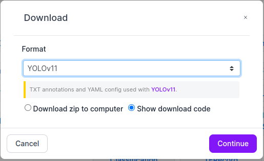

# Local Simulation with Docker

## Clone the repo
First, clone the repo to local machine. Navigate to the root of the repo.

## Running Docker
### With Dockerfile and dockerhub

Build custom docker image using

```bash
./scripts/docker/create_docker_image.sh
```
The script would prompt for a `<DOCKER_TAG>`.

Then, pull the image and run docker container with all dependencies pre-built into the container:

```bash
sudo docker run --gpus all --ipc=host --ulimit memlock=-1 --ulimit stack=67108864 -it --rm --net=host --runtime nvidia -e DISPLAY=$DISPLAY -v /tmp/.X11-unix/:/tmp/.X11-unix -v <PATH_CONTAINING_ULTRAFLWR>/UltraFlwr:/UltraFlwr <DOCKER_TAG>
```


### Without using Dockerfile

Assuming the machine has a Nvidia GPU, first, [Nvidia Container Runtime](https://docs.nvidia.com/datacenter/cloud-native/container-toolkit/latest/install-guide.html) is needed.

Then, spin up a docker container using the following command, update the `<PATH_CONTAINING_ULTRAFLWR>` accordingly:

```bash
sudo docker run --gpus all --ipc=host --ulimit memlock=-1 --ulimit stack=67108864 -it --rm --net=host --runtime nvidia -e DISPLAY=$DISPLAY -v /tmp/.X11-unix/:/tmp/.X11-unix -v <PATH_CONTAINING_ULTRAFLWR>/UltraFlwr:/UltraFlwr ultralytics/ultralytics:8.3.101
```

In the docker container, `cd` to `\UltraFlwr`.

Install Dependencies:

```bash
apt update
apt install lsof
pip install prettytable==3.16.0 flwr==1.17.0
```

Check `FedYOLO/config.py` to see the default configurations, especially regarding `BASE`, `DATASET_NAME`, and `NUM_CLIENTS`.

If you are running docker following the command provided, `BASE` needs to be empty.

## Prepare Datasets

1. `cd` into the datasets folder: `cd datasets`
2. Make a directory for a specific dataset: `mkdir pills`
3. `cd` into the dataset folder: `cd pills`
4. Get data-set from Roboflow
5. Create a directory for the client specific datasets: `mkdir partitions`
6. Create the partitions
7. Go to the base of the clone: `cd ../../`
   - Create the splits: `python FedYOLO/data_partitioner/fed_split.py` 
   - To choose the dataset, change the `DATASET_NAME` parameter in the `FedYOLO/config.py` file


### To Build Custom Dataset

Follow the style of roboflow downloads as mentioned in above steps.



## Training

For one-off: `./scripts/federated_train_and_test/run.sh`

For multiple Runs, reference: `bash scripts/federated_train_and_test/benchmark.sh`

For normal YOLO training on entire server dataset and client data partitions: `bash scripts/central_train_and_test/run_local_train_and_test.sh`